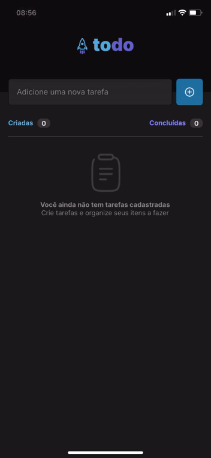
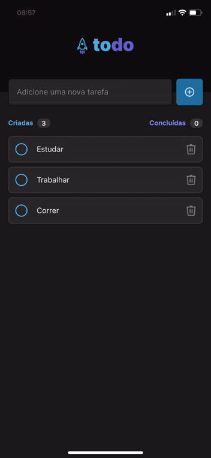
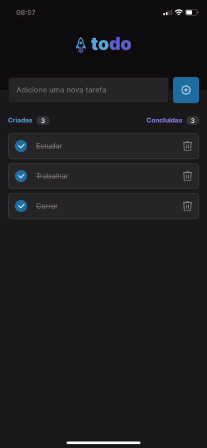

<br /><br />

<h4 align="center">

</h4>
<br /><br />

# 💡 Sobre

**Simples aplicativo de To-Do List em React Native. [Desafio](https://efficient-sloth-d85.notion.site/Desafio-01-Praticando-os-conceitos-do-React-Native-f8f164e29df74cd987e1f9aebf142ffb) Ignite Rockeseat**

# ⚙️ Como rodar

### 📃 Pré-requisito

- **Node** v14.21.3
- **Expo Go App**

### 💻 No PC

- **Clonar repositório**
- **Dentro da pasta do projeto execute:**

```bash
$ npm install
```

- **E então, execute:**

```bash
$ npx expo start
```

### 📱 No Smartphone

- **Download aplicativo _Expo Go_ no seu smartphone** </br>
- **No Expo Go, click em _Scan QR code_, e escaneie o que está aparecendo no terminal do seu PC** </br>
- **Pronto!**

# 📲 Funcionalidades

- **Voce pode criar, marcar, remover suas tarefas**

**➕ Criar**                         
                   **✔ Marcar**             
                             **❌ Remover**

<p align="center">





</p>

# 💻 Tecnologias

  
